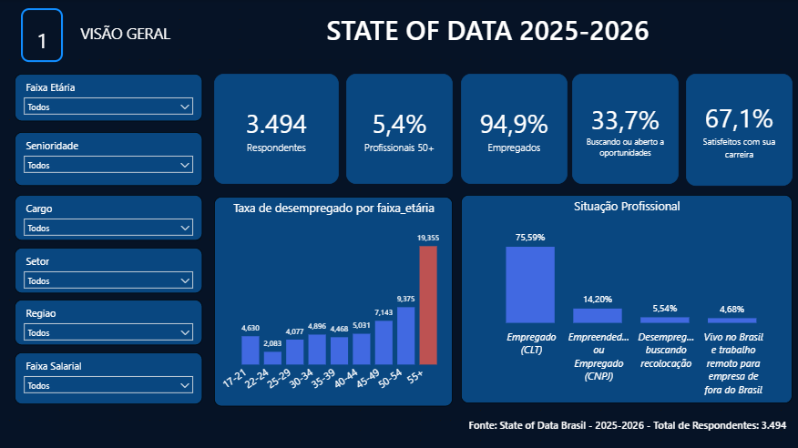
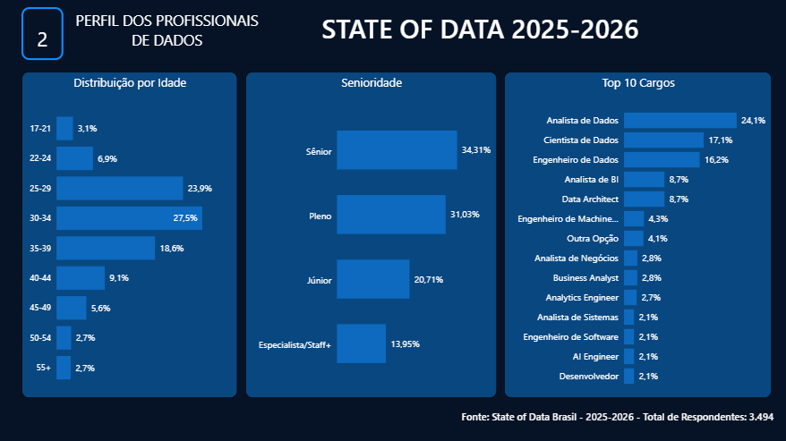
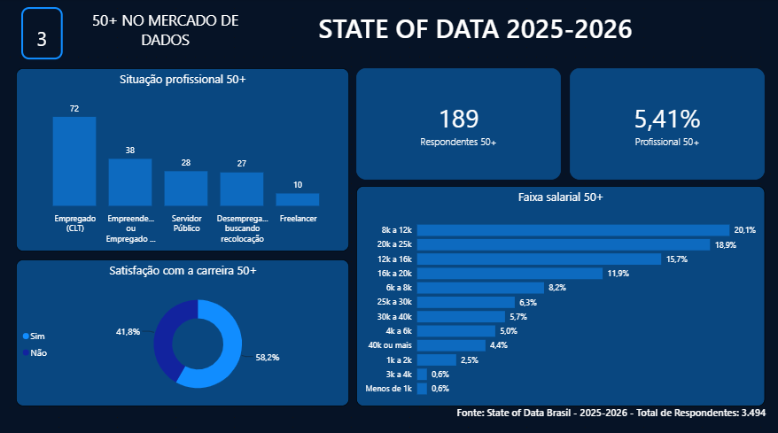

# State of Data Brasil (2025-2026) - Perspectiva 50+

## Sobre o Projeto
Este projeto foi desenvolvido como conclusão do módulo de **Visualização de Dados: Power BI** do curso **Formação Full Stack em Dados & Analytics** da **Pod Academy**. 

A análise é baseada na edição 2025-2026 da pesquisa **State of Data Brazil**, realizada em parceria pelo **Data Hackers** e pela **Bain & Company**[cite: 2]. O objetivo central do dashboard é analisar o mercado de trabalho em dados sob uma perspectiva focalizada nos **profissionais com 50 anos ou mais (50+)**, mapeando sua representatividade, distribuição salarial, situação profissional e satisfação com a carreira.

## Principais Indicadores Analisados
* **Visão Geral:** Panorama geral da base de respondentes, destacando o percentual de profissionais 50+, taxas de emprego e satisfação geral.
* **Perfil dos Profissionais de Dados:** Distribuição etária da comunidade de dados, faixas de senioridade e principais cargos ocupados no mercado nacional.
* **Análise Específica 50+:** Aprofundamento na situação profissional, níveis de satisfação com a carreira e distribuição de faixa salarial dos profissionais com mais de 50 anos.

## Estrutura do Dashboard
O relatório interativo desenvolvido em Power BI está dividido em três páginas:

### 1. Visão Geral
Painel consolidado com indicadores macro da pesquisa, filtros globais e a taxa de desemprego por faixa etária.

### 2. Perfil dos Profissionais de Dados
Análise da distribuição demográfica por idade, os níveis de senioridade e o ranking dos principais cargos da área.

### 3. 50+ no Mercado de Dados
Aprofundamento focado nos profissionais com 50 anos ou mais, detalhando sua situação profissional atual, faixas salariais e satisfação com a carreira.

## Tecnologias Utilizadas
* **Power BI:** Tratamento de dados (Power Query), modelagem e construção de visualizações.
* **Formato PBIP (Power BI Project):** Organização estruturada do projeto para versionamento de código.

## Fonte dos Dados
* **State of Data Brazil (2025-2026):** Parceria Data Hackers e Bain & Company[cite: https://www.kaggle.com/datasets/datahackers/state-of-data-brazil-2025-2026].